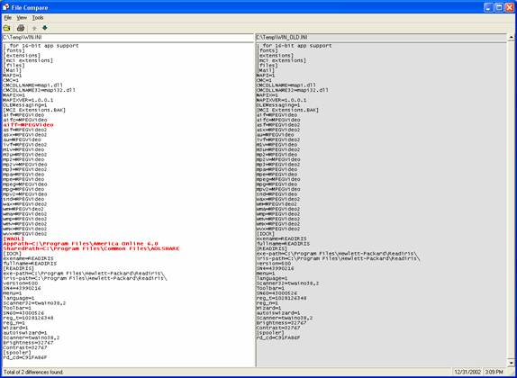



## File Compare With Color

### Description

File compare utility to compare two ASCII text files. Differences are highlighted in color. Options exist to add additional text file extensions, to define default directories for the two compared files, and to select a particular font to use in the display. A basic print function also exists. I originally created this utility for use in comparing program code, but it can be used for any text file.
 
### More Info
 

             |
---                |---
**Submitted On**   |2002-12-31 17:34:26
**By**             |[Tim Taff](https://github.com/Planet-Source-Code/PSCIndex/blob/master/ByAuthor/tim-taff.md)
**Level**          |Intermediate
**User Rating**    |5.0 (40 globes from 8 users)
**Compatibility**  |VB 4\.0 \(32\-bit\), VB 5\.0, VB 6\.0
**Category**       |[Complete Applications](https://github.com/Planet-Source-Code/PSCIndex/blob/master/ByCategory/complete-applications__1-27.md)
**World**          |[Visual Basic](https://github.com/Planet-Source-Code/PSCIndex/blob/master/ByWorld/visual-basic.md)
**Archive File**   |[File\_Compa152143112003\.zip](https://github.com/Planet-Source-Code/tim-taff-file-compare-with-color__1-42039/archive/master.zip)

